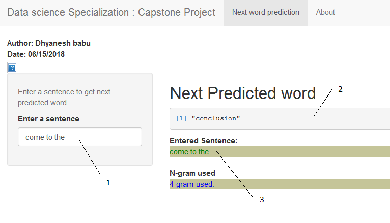

### Coursera Data Science -  Capstone Project

This application is the capstone project for the Coursera Data Science specialization

#### The Objective

The main goal of this capstone project is to build a shiny application that is able to predict the next word. 

#### The Applied Methods & Models

After creating a data sample from the HC Corpora data, this sample was cleaned.

This data sample was then tokenized into n-gram.

Those aggregated bi-,tri- and quadgram term frequency matrices 
have been transferred into frequency dictionaries.

The resulting data.frames are used to predict the next word.

#### The Usage Of The Application

The user interface of this application was designed with **Mobile First** in mind. While entering the text (**1**), the field with the predicted next word (**2**) refreshes instantaneously and  also the whole text input (**3**) gets displayed.

