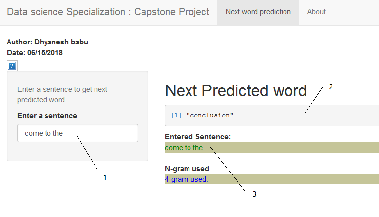

Coursera Data Science specialization -  Capstone Project
========================================================
author: Dhyanesh babu

This presentation will briefly but comprehensively pitch an [application](https://dhyaneshbabu.shinyapps.io/NextWordPrediction/) for predicting the next word.

The application is the capstone project for the Coursera Data Science specialization from Johns Hopkins University and in collabration with SwiftKey.

The Objective
========================================================

The main goal of this capstone project is to build a shiny application that is able to predict the next word. 

It has few sub tasks 
 #1.data cleaning
 #2.exploratory analysis
 #3.The creation of a predictive model.

The data file is from (http://www.corpora.heliohost.org/). 

All NLP was done with the usage of a variety of well-known R packages.

The Predictive Models
========================================================

After cleaning of the data removing whitespace,special charector,repeative words.
etc.

This data sample was then tokenized called n-gram 

Those aggregated bi-,tri- and quadgram term frequency matrices have been transferred into frequency dictionaries.

The resulting data.frames are used to predict the next word in connection with the text input by a user of the described application and the frequencies of the underlying *n*-grams table.

The Usage of the App
========================================================

The user interface of this application was designed with **Mobile First** in mind. While entering the text (**1**), the field with the predicted next word (**2**) refreshes instantaneously and  also the whole text input (**3**) gets displayed.

Additional Information
========================================================

* The next word prediction app is hosted on shinyapps.io: [https://dhyaneshbabu.shinyapps.io/NextWordPrediction/](https://dhyaneshbabu.shinyapps.io/NextWordPrediction/)

* The whole code of this application can be found in this GitHub repo: [https://github.com/mhnierhoff/CapstoneCoursera](https://github.com/mhnierhoff/CapstoneCoursera)

*  Coursera Data Science Specialization: [https://www.coursera.org/specialization/jhudatascience/1](https://www.coursera.org/specialization/jhudatascience/1)
